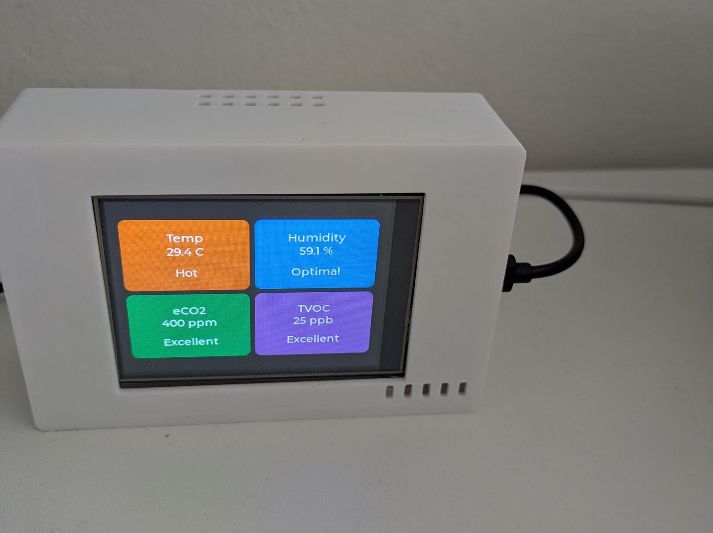
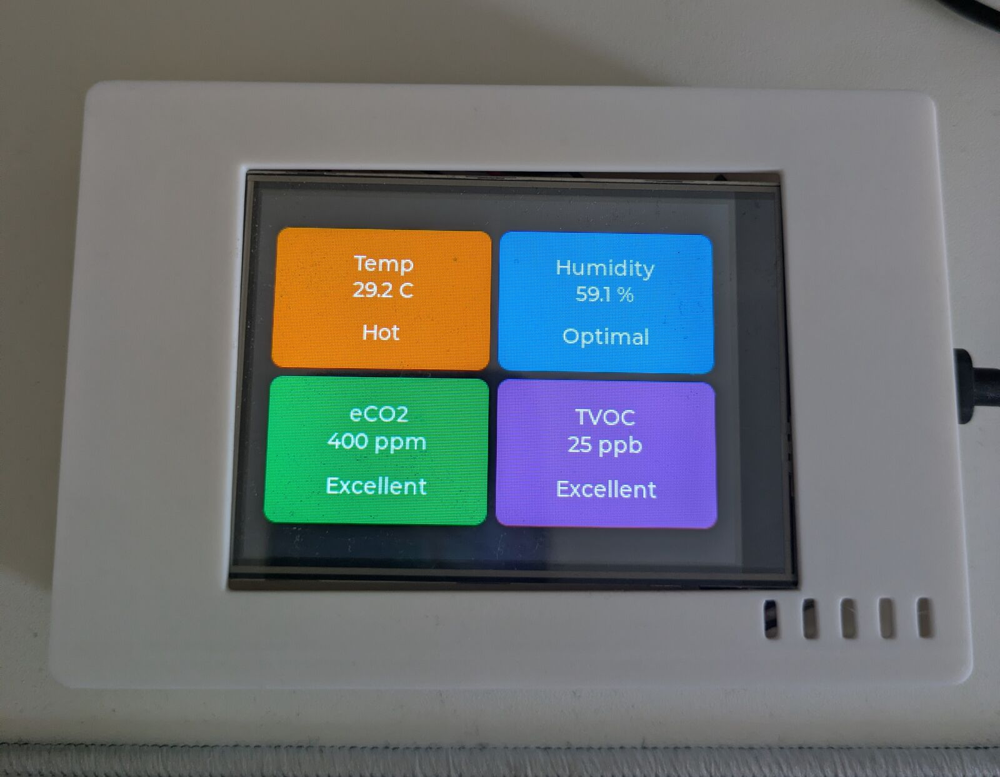
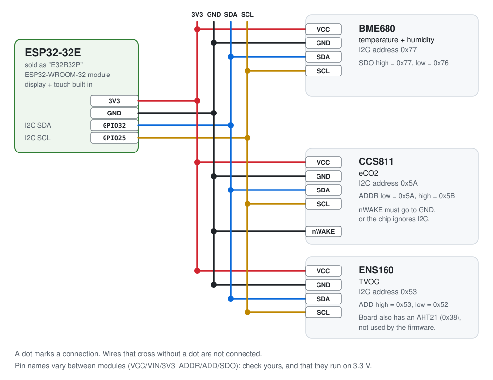
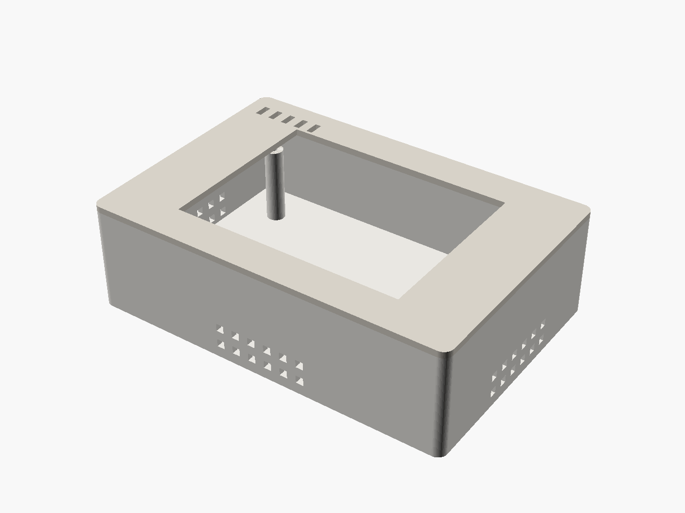
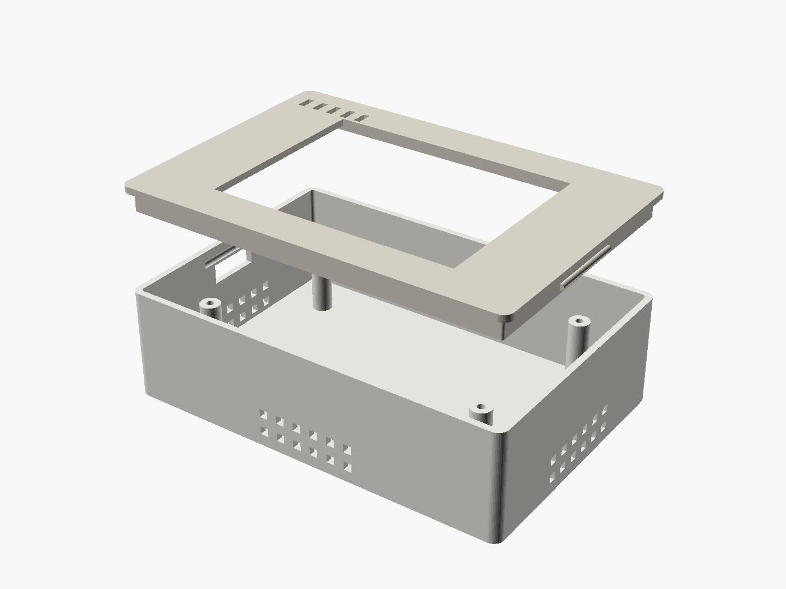

# ESP32 air-quality monitor

[](LICENSE)
[](enclosure/LICENSE)

An ESP32 air-quality monitor for my desk: firmware, a 3D-printable enclosure and wiring for BME680, CCS811 and ENS160 sensors.



It shows temperature, humidity, eCO2 and TVOC on the board's built-in 3.2" screen, and this repo has everything I used to build it.

I'm a software person, and the hardware side was the hard part for me. If you're in the same spot, this README spells out the things I had to figure out.

**Blog post:** [ESP32 - building an air-quality monitor with a coding agent](https://kopecky.io/blog/2026-09-28-esp32-air-quality-monitor/)

> **Status: the cleaned-up firmware in this repo is untested on hardware.** I built this monitor and ran an earlier, messier version of the firmware on it. Then I tidied the code for this repo (LVGL from the component manager, shared I2C helper, one pins header, BME680 gas heater off, a fix to the eCO2/TVOC averaging). It compiles cleanly with ESP-IDF v5.5.2, but I'm traveling and can't flash the board right now, so this exact version hasn't run on it yet. If something breaks, please open an issue.

---

- [What it measures](#what-it-measures)
- [Bill of materials](#bill-of-materials)
- [How it's wired](#how-its-wired)
- [The enclosure](#the-enclosure)
- [Build and flash the firmware](#build-and-flash-the-firmware)
- [Troubleshooting](#troubleshooting)
- [How the firmware works](#how-the-firmware-works)
- [Repo layout](#repo-layout)
- [Notes and lessons learned](#notes-and-lessons-learned)
- [Acknowledgements and licenses](#acknowledgements-and-licenses)

## What it measures



| Card | Sensor | Label under the value, from low to high |
| --- | --- | --- |
| **Temp** (°C) | BME680 | Cold (< 18) · Cool (18–20) · Comfortable (20–26) · Warm (26–28) · Hot (≥ 28) |
| **Humidity** (% RH) | BME680 | Dry (< 30) · Low (30–40) · Optimal (40–60) · High (60–70) · Humid (≥ 70) |
| **eCO2** (ppm) | CCS811 | Excellent (< 600) · Good (600–800) · Fair (800–1000) · Poor (1000–1500) · Very Poor (≥ 1500) |
| **TVOC** (ppb) | ENS160 | Excellent (< 100) · Good (100–200) · Fair (200–400) · Poor (400–600) · Very Poor (≥ 600) |

The sensors are read every 5 seconds, and each card shows the average of the last 5 readings (about 25 seconds). The label thresholds are rough rules of thumb I picked, not an official standard. They live in [`ui_air_quality.c`](firmware/main/ui_air_quality.c) if you want different ones.

Before you trust the numbers:

- **Warm-up.** The gas sensors need time after power-on. Until the CCS811 delivers its first reading, the eCO2 card shows **"Warming" / "Please wait"**. The ENS160 reports TVOC while it is still warming up, and the firmware shows those values, so treat the first readings as rough. The log reminds you that the CCS811 needs about 20 minutes and the ENS160 about an hour for full accuracy.
- **eCO2 is an estimate.** The CCS811 doesn't measure CO2. It estimates an "equivalent CO2" from the gases it detects, and its lowest output is 400 ppm. So "400 ppm" means "clean air", not an exact measurement.
- **Temperature reads high.** The ESP32 and the display backlight heat up the inside of the box, and the case has almost no airflow, so the temperature card shows noticeably more than the real room temperature (my photos show about 29 °C). The BME680's gas heater is switched off in the firmware so it doesn't add to this (see [`bme680_driver.c`](firmware/main/bme680_driver.c)). Treat the temperature as approximate. A better enclosure would fix most of it, see [the enclosure section](#the-enclosure).
- **Compensation.** Every reading, the BME680's temperature and humidity are passed to the CCS811 and ENS160 so they can correct their gas readings.

**Why three sensors?** I read that when one of these sensors is also used for temperature, its other readings get worse. So instead of working around that, I bought more sensors and gave each one a single job.

## Bill of materials

| Part | Qty | Notes |
| --- | --- | --- |
| ESP32-32E 3.2" display board ("E32R32P") | 1 | ESP32-WROOM-32, 240x320 ST7789P3 IPS display, XPT2046 resistive touch. [The AliExpress listing I bought from](https://www.aliexpress.com/item/1005008239809369.html). |
| BME680 breakout module | 1 | Bosch temperature / humidity / pressure / gas sensor. I2C address 0x77. |
| CCS811 breakout module | 1 | eCO2 / TVOC sensor. I2C address 0x5A. |
| ENS160 breakout module | 1 | ScioSense TVOC / eCO2 sensor. I2C address 0x53. |
| M2.5 self-tapping screws | 4 | Hold the board on the enclosure standoffs. |
| USB-C cable + 5 V USB power supply | 1 | For power, and for flashing from your computer. |
| Wire | – | Four wires per sensor, plus one for the CCS811's nWAKE pin. I soldered mine. |
| PLA filament | ~67 g | For the [enclosure](enclosure/). |

Sensor breakouts come from many sellers and differ in pin names and address jumpers, so check the notes below against your modules.

## How it's wired

The display and touch screen are built into the board. The only wiring is the three sensor modules, which all share **one I2C bus**:



| ESP32-32E | BME680 | CCS811 | ENS160 |
| --- | --- | --- | --- |
| 3V3 | VCC | VCC | VCC |
| GND | GND | GND **and nWAKE** | GND |
| GPIO32 (SDA) | SDA | SDA | SDA |
| GPIO25 (SCL) | SCL | SCL | SCL |

- **I2C** is a two-wire bus (SDA = data, SCL = clock) that several chips can share. Each chip has its own address, so they don't clash.
- **CCS811 nWAKE → GND.** The CCS811 only answers on I2C while nWAKE is low, so tie it to ground.
- **Addresses.** The firmware expects BME680 `0x77`, CCS811 `0x5A` and ENS160 `0x53`. On boot it scans the bus and logs every address it finds, which is the quickest way to check your wiring. If a module shows up at its other address (BME680 `0x76`, CCS811 `0x5B`, ENS160 `0x52`), change the address constant at the top of its driver in [`firmware/main/`](firmware/main/), or change the address pin on the module.
- **Pull-ups.** I2C needs pull-up resistors on SDA and SCL. The firmware turns on the ESP32's internal ones, and most breakout modules have their own.
- **Check your module.** Pin labels vary (VCC/VIN/3V3, ADD/ADDR/SDO), and so does whether a module runs on 3.3 V. Where 3V3, GND, GPIO32 and GPIO25 come out on the board depends on its connectors, so check the seller's pinout.

### Full pin map

All GPIOs are defined in [`firmware/main/pins.h`](firmware/main/pins.h). The display driver reads its pins from [`firmware/sdkconfig.defaults`](firmware/sdkconfig.defaults), and the build fails if the two files ever disagree.

| Function | GPIO | Notes |
| --- | --- | --- |
| I2C SDA (sensors) | 32 | 100 kHz |
| I2C SCL (sensors) | 25 | |
| SPI MOSI (display + touch) | 13 | SPI2 / HSPI |
| SPI MISO (touch) | 12 | |
| SPI CLK (display + touch) | 14 | |
| Display CS | 15 | |
| Display DC | 2 | |
| Display backlight | 27 | active high |
| Display reset | – | tied to the ESP32 EN pin; the driver sends a software reset instead |
| Touch CS | 33 | |
| Touch IRQ | 36 | input-only pin |

## The enclosure

| Assembled | Exploded |
| --- | --- |
|  |  |

Two printed parts, designed in OpenSCAD:

- **Base:** four standoffs for the board (M2.5 self-tapping screws), a USB-C opening, vent holes low on three walls, and 25 mm of room under the board for the sensors.
- **Lid:** a window for the display and five exhaust slots. It snaps into the base with a bead on each side, so it needs no screws.

**Known limitation: airflow.** The vents turned out to be too few and too small. The ESP32 and the backlight keep heating the closed box, air barely moves through it, and the temperature reading ends up well above the room temperature. The next iteration should have more ventilation, so that air really flows past the sensors, or the sensors should sit outside the warm part of the case. Pull requests to the SCAD files are welcome.

The outer size is 118 x 80 x 35 mm. I printed both parts in PLA on a Prusa CORE One (0.4 mm nozzle, 0.2 mm layers) in about 1.5 hours. The STLs are in [`enclosure/stl/`](enclosure/stl/). Dimensions, print settings and how to adapt the case to a different board are in [`enclosure/README.md`](enclosure/README.md).

## Build and flash the firmware

The firmware is an [ESP-IDF](https://docs.espressif.com/projects/esp-idf/en/v5.5.2/esp32/) project in [`firmware/`](firmware/), with a [LVGL](https://lvgl.io/) 8.3 UI. It's tested with **ESP-IDF v5.5.2**. LVGL is downloaded automatically on the first build.

### Option A: build in a container (only needs Docker or Podman)

```sh
git clone https://github.com/MQ37/esp32-air-quality-monitor.git
cd esp32-air-quality-monitor/firmware

podman run --rm -v "$PWD":/project:Z -w /project docker.io/espressif/idf:v5.5.2 \
  bash -c 'idf.py set-target esp32 && idf.py build'
```

With Docker, replace `podman` with `docker` (the `:Z` suffix only matters on SELinux systems). The build leaves `build/esp32-air-quality-monitor.bin`, the bootloader and the partition table in `build/`.

To flash from your computer, install [esptool](https://docs.espressif.com/projects/esptool/) (`pip install esptool`) and run this from the `build/` folder. It's the command the build prints, plus the serial port:

```sh
cd build
python -m esptool --chip esp32 -p /dev/ttyUSB0 -b 460800 \
  --before default_reset --after hard_reset write_flash "@flash_args"
```

Then open any serial monitor at **115200 baud** to see the log.

### Option B: native ESP-IDF

Install ESP-IDF v5.5.2 following [Espressif's guide](https://docs.espressif.com/projects/esp-idf/en/v5.5.2/esp32/get-started/index.html), then:

```sh
cd esp32-air-quality-monitor/firmware
. $HOME/esp/esp-idf/export.sh        # wherever you installed ESP-IDF
idf.py set-target esp32
idf.py build
idf.py -p /dev/ttyUSB0 flash monitor # Ctrl+] quits the monitor
```

### Finding your serial port

Plug the board in over USB-C and look for the new device:

- **Linux:** `ls /dev/ttyUSB* /dev/ttyACM*` (or `dmesg | tail` right after plugging in). If you get "permission denied", add yourself to the `dialout` group (`uucp` on Arch) and log in again.
- **macOS:** `ls /dev/cu.*`
- **Windows:** Device Manager → *Ports (COM & LPT)*, then use e.g. `-p COM5`.

If no port shows up, try another cable (some are charge-only) or install the driver for your board's USB-serial chip.

### Changing settings

Build settings live in [`firmware/sdkconfig.defaults`](firmware/sdkconfig.defaults). ESP-IDF creates `firmware/sdkconfig` from it on the first build and uses that file from then on, so after editing the defaults, delete `firmware/sdkconfig` and rebuild. For quick experiments, `idf.py menuconfig` edits `sdkconfig` directly.

## Troubleshooting

Most of these cost me time. The display ones are already fixed in this repo; they're here so you recognise them if you change the display settings or port this to another board (background in [docs/display-init.md](docs/display-init.md)).

| Symptom | Likely cause | What to do |
| --- | --- | --- |
| Backlight is on but the screen stays black | Wrong SPI mode | The ST7789P3 needs SPI **mode 0** (`SPI_TFT_SPI_MODE` in `lvgl_spi_conf.h`). Mode 2, the upstream default, gives exactly this. |
| Colours look inverted, like a negative | Display inversion off | Keep `CONFIG_LV_INVERT_COLORS=y` (IPS panel). |
| Colours are wrong but not inverted | RGB565 byte order | Keep `CONFIG_LV_COLOR_16_SWAP=y`. |
| Garbled or unstable picture | SPI clock too fast | The driver uses 5 MHz. If you raised it, go back down. |
| Display never initialises (e.g. on a similar board) | Panel reset isn't on a GPIO | On this board the panel reset is tied to EN, so keep `CONFIG_LV_DISP_USE_RST=n`. The driver then sends a software reset. |
| Log says `No I2C devices found` | Sensor wiring | Check 3V3 and GND, and that SDA and SCL aren't swapped. |
| `CCS811 initialization failed` / `Failed to read HW ID` | nWAKE floating or wrong address | Tie CCS811 nWAKE to GND. Check the scan log for 0x5A vs 0x5B. |
| `BME680 init failed` | Module at 0x76 | Use `BME68X_I2C_ADDR_LOW` in `bme680_driver.c`, or pull SDO high. |
| eCO2 or TVOC stays on "Warming" | Normal after power-on | The gas sensors need time. The log shows what they report while warming up. |
| eCO2 always shows 400 ppm | Clean air | 400 ppm is the CCS811's lowest output. |
| Touch is offset or mirrored (if you add a touch UI) | Calibration | Adjust `CONFIG_LV_TOUCH_*` in `sdkconfig.defaults`. |
| Changes in `sdkconfig.defaults` seem ignored | Old `sdkconfig` | Delete `firmware/sdkconfig` and rebuild. |

## How the firmware works

Everything runs in one loop in `app_main`, with no tasks of its own:

1. **Start-up** ([`main.c`](firmware/main/main.c)): switch on the backlight, init NVS, start the I2C bus and scan it, and init the three sensors. Then init LVGL and the display ([`lvgl_port.c`](firmware/main/lvgl_port.c)) and draw the four cards ([`ui_air_quality.c`](firmware/main/ui_air_quality.c)).
2. **Every 10 ms:** `lv_timer_handler()` lets LVGL redraw. A 10 ms `esp_timer` drives LVGL's clock.
3. **Every 5 s:** trigger a BME680 measurement and read temperature and humidity, pass both to the CCS811 and ENS160 for compensation, then read TVOC from the ENS160 and eCO2 from the CCS811. Each value goes into a 5-slot ring buffer, and the cards show the averages. A gas value of 0 means "no data yet": it's left out of the average, and the card shows "Warming" until a real reading arrives.

The drivers are small:

- [`bme680_driver.c`](firmware/main/bme680_driver.c) wraps Bosch's BME68x Sensor API (forced mode).
- [`ccs811_driver.c`](firmware/main/ccs811_driver.c) is a minimal register-level driver (1-second measurement mode).
- [`ens160_driver.c`](firmware/main/ens160_driver.c) wraps ScioSense's official C driver (standard mode).
- [`i2c_bus.c`](firmware/main/i2c_bus.c) has the register read/write helpers all three share.

The display side uses a patched copy of [lvgl_esp32_drivers](https://github.com/lvgl/lvgl_esp32_drivers) (ST7789 + XPT2046 over SPI). Touch is registered with LVGL, but the current UI doesn't use it.

## Repo layout

```text
.
├── firmware/                      ESP-IDF project (run idf.py here)
│   ├── main/                      application code
│   │   ├── main.c                 start-up + main loop
│   │   ├── pins.h                 every GPIO in one place
│   │   ├── i2c_bus.c/.h           shared I2C helpers
│   │   ├── bme680_driver.c/.h     BME680 wrapper
│   │   ├── ccs811_driver.c/.h     CCS811 driver
│   │   ├── ens160_driver.c/.h     ENS160 wrapper
│   │   ├── lvgl_port.c/.h         LVGL <-> display/touch glue
│   │   ├── ui_air_quality.c/.h    the four-card screen
│   │   └── idf_component.yml      pulls LVGL 8.3.11 from the component registry
│   ├── components/
│   │   ├── lvgl_esp32_drivers/    display + touch drivers (patched, see THIRD_PARTY.md)
│   │   ├── bme68x/                Bosch BME68x Sensor API v4.4.8
│   │   └── sciosense_ens160/      ScioSense ENS160 driver
│   ├── sdkconfig.defaults         build settings (display, touch, pins)
│   ├── partitions.csv             4 MB flash layout with a 3 MB app slot
│   └── dependencies.lock          exact component versions
├── enclosure/                     OpenSCAD sources, STLs, renders (CC BY 4.0)
├── docs/
│   ├── wiring.svg                 wiring diagram
│   ├── display-init.md            ST7789P3 bring-up notes and init sequence
│   ├── images/                    photos
│   └── social-preview.png         the repo's social card image
├── LICENSE                        MIT (firmware and docs)
└── THIRD_PARTY.md                 third-party code, versions and patches
```

## Notes and lessons learned

- **The hardware was the hard part.** The board came with a couple of example files and a thin datasheet. Getting from "the demo works" to my own firmware meant fighting build errors, flashing and pin configuration. For a while the backlight was on but the screen stayed black, which turned out to be the wrong SPI mode.
- **A coding agent got me through it.** I'm not experienced with embedded tooling. Working through the build errors, flashing and pin config together with a coding agent is what made this project happen.
- **An LLM designed the enclosure.** I measured the board and its holes and gave the numbers to an LLM (I think GLM 5.1 or one of the Kimi models, I don't remember exactly), which wrote the OpenSCAD code for a two-part case. I printed it, screwed the board in and that was it.
- **First time soldering.** The joints aren't pretty, but they work.
- **The case runs hot.** The enclosure traps heat, so the temperature reads much higher than it really is. The next version needs more ventilation.

## Acknowledgements and licenses

- My code and docs: [MIT](LICENSE). Enclosure files: [CC BY 4.0](enclosure/LICENSE).
- [LVGL](https://lvgl.io/) (MIT) for the UI.
- [lvgl_esp32_drivers](https://github.com/lvgl/lvgl_esp32_drivers) (MIT) for the display and touch drivers, patched here for ESP-IDF 5 and this panel.
- [Bosch Sensortec BME68x Sensor API](https://github.com/boschsensortec/BME68x_SensorAPI) (BSD-3-Clause).
- [ScioSense ENS16x driver](https://github.com/sciosense/ens16x-arduino) (MIT).
- [Espressif ESP-IDF](https://github.com/espressif/esp-idf) (Apache-2.0).

Versions, upstream links and the exact list of local changes are in [THIRD_PARTY.md](THIRD_PARTY.md).
