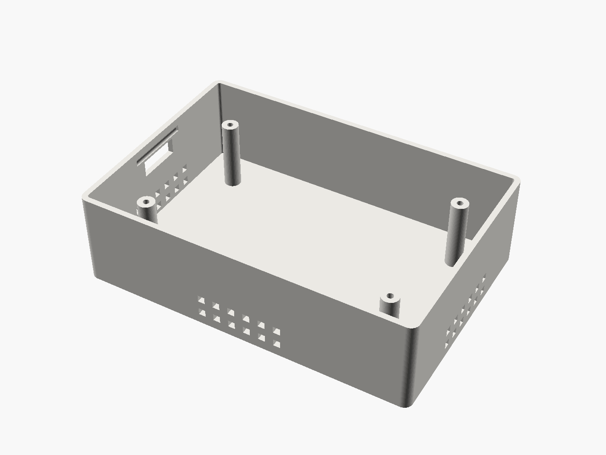
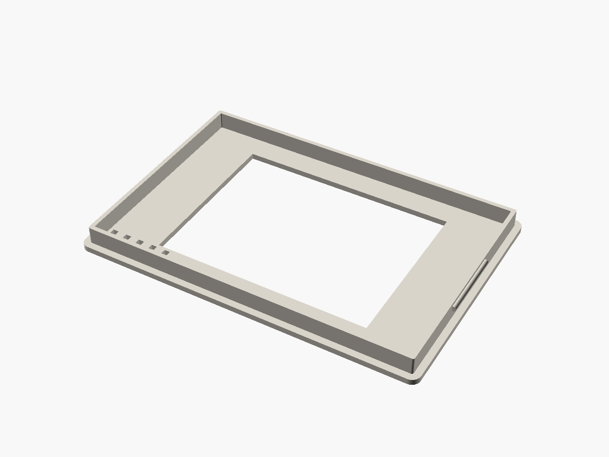

# Enclosure

A two-part, 3D-printable case for the ESP32-32E board and its sensors, written in [OpenSCAD](https://openscad.org/).


| Base | Lid (flipped, showing the skirt) |
| --- | --- |
|  |  |

- **Base**: an open box with four standoffs for the board, a USB-C opening in the left wall, two rows of vent holes low on three walls, and 25 mm of free space under the board for the sensor modules.
- **Lid**: a frame with a window for the display and five exhaust slots. A skirt drops into the base, and a small bead on each side clicks into a groove in the base wall. No screws. Press to close, pry to open.

The idea is that air comes in through the low wall vents, passes the sensors and leaves through the lid slots. In practice the airflow is weak, the box heats up and the temperature reading comes out high, so a next version should have more ventilation.

## Files

| File | What it is |
| --- | --- |
| `common.scad` | All dimensions and shared helpers. Start here if you want to change something. |
| `case_base.scad` | The base. |
| `case_top.scad` | The lid. |
| `assembly.scad` | Preview only: assembled / exploded / single-part views used for the renders. |
| `stl/case_base.stl`, `stl/case_top.stl` | Ready-to-slice exports of the two parts. |
| `renders/*.png` | Preview images. |

The STLs match the current `.scad` files.

## Dimensions

| Part | Size |
| --- | --- |
| Outer size (closed) | 118 x 80 x 35 mm |
| Board | 94 x 56 mm, 5.5 mm total stack height (PCB + display + parts on the back) |
| Board holes | one per corner, centres 3 mm in from each edge, so 88 x 50 mm apart |
| Standoffs | 6 mm diameter, 25 mm tall, 2.2 mm pilot hole for **M2.5 self-tapping screws** (4 needed) |
| Space under the board | 25 mm |
| Display window | 74 x 56 mm (the board is 94 mm wide; 10 mm on each side is not display) |
| USB-C opening | 16 x 6 mm, centred on the left wall |
| Walls / floor / lid plate | 2 mm |
| Clearance around the board | 10 mm on every side, for cables |

If your board differs, measure it and change `board_w`, `board_l`, `board_th`, `hole_inset` and `disp_w` / `disp_l` in `common.scad`. Everything else is derived from those.

## Printing

What I used: **Prusa CORE One, PLA, 0.4 mm nozzle, 0.2 mm layers** (OrcaSlicer, "0.20mm SPEED @CORE One HF 0.4" profile, 15 % infill, 2 walls). Both parts on one plate took about 1 h 33 min and 67 g of filament.

Orientation: the base prints open side up, as exported. The lid STL is exported the way it sits on the case (skirt down), so flip it in the slicer and print it with its flat top on the bed.

Supports: I had the slicer's automatic supports switched on. They only ended up in the base, inside the USB-C opening and the wall vent holes (small horizontal openings in a vertical wall). The lid, printed flat side down, needs none.

The snap fit depends on your printer's tolerances. If the lid is too tight or too loose, tweak `skirt_gap` (clearance) or `snap_r` (bead size) in `common.scad`.

## Exporting and rendering

```sh
openscad -o stl/case_base.stl case_base.scad
openscad -o stl/case_top.stl  case_top.scad

# preview images
openscad --imgsize=1400,1050 --viewall --autocenter --colorscheme=Tomorrow \
  --camera=0,0,0,60,0,35,300 -D 'view="exploded"' -o renders/exploded.png assembly.scad
```

For the other images, set `view` to `"assembled"`, `"base"` or `"lid"` (the lid image uses a different camera angle). The renders here were made with OpenSCAD 2021.01.

## How it was designed

I measured the board and its mounting holes, gave the numbers to an LLM and it wrote the OpenSCAD code. I printed it, screwed the board in and that was it.

## License

The enclosure files are licensed under [CC BY 4.0](LICENSE). The firmware in this repository is MIT-licensed.
